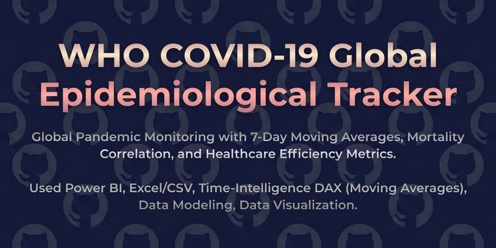
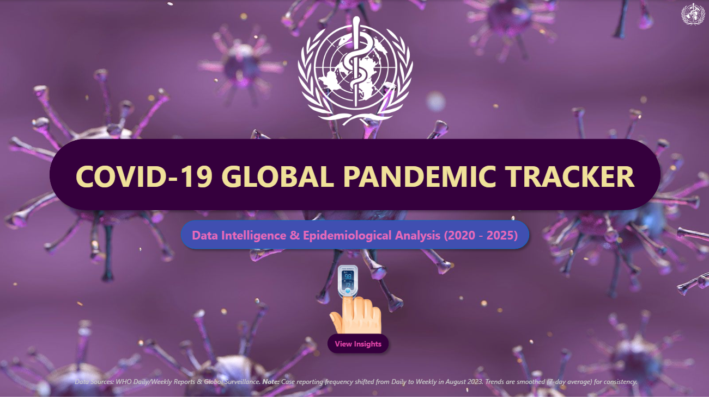
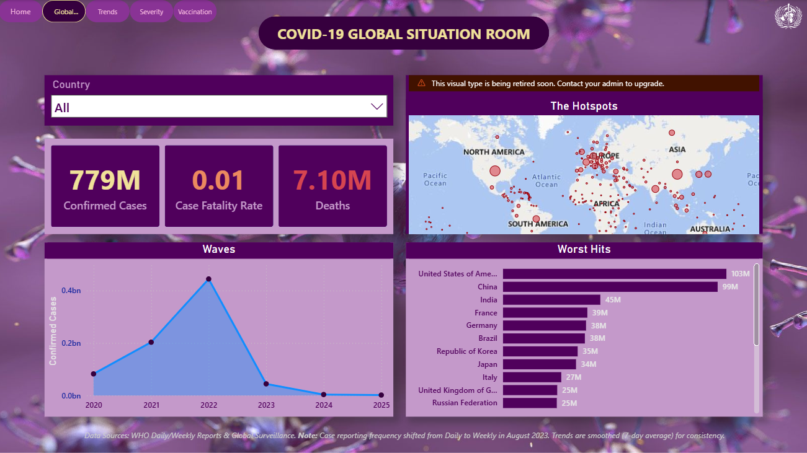
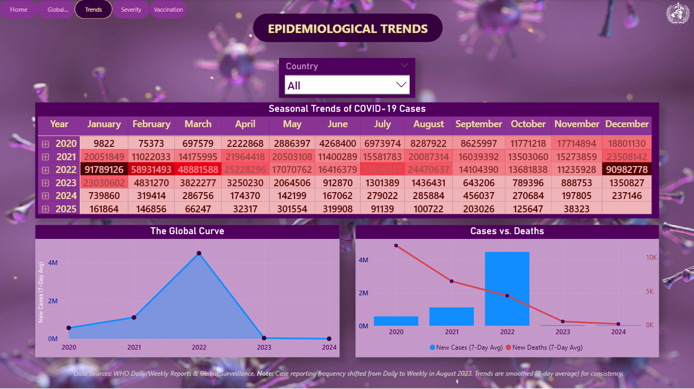
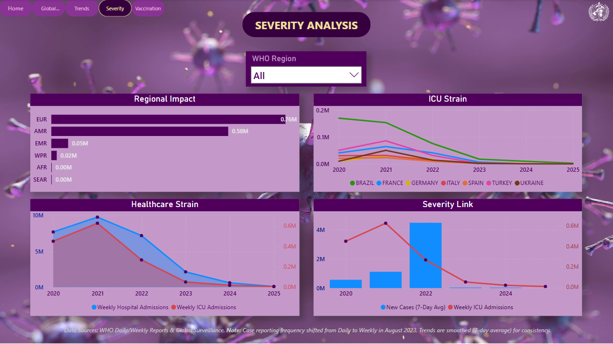
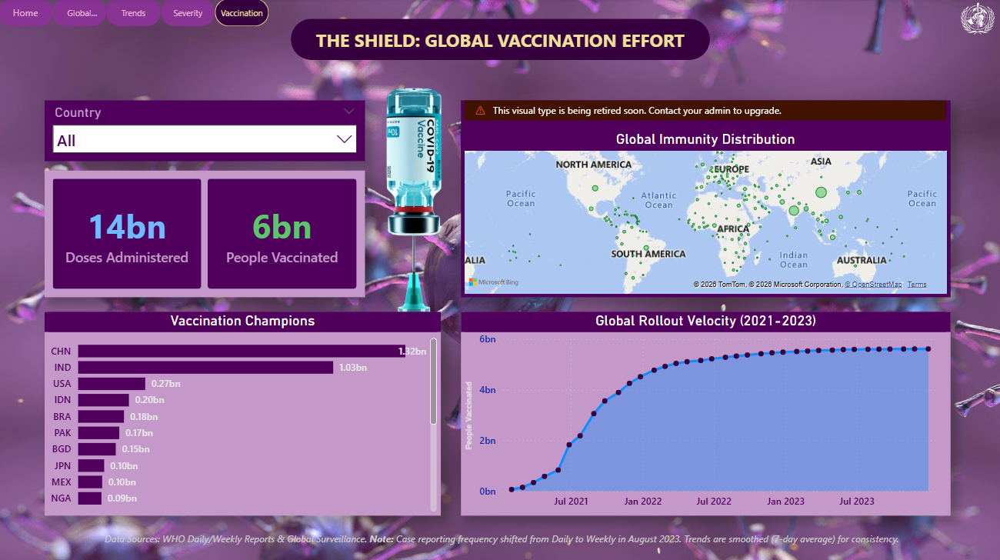

  

# 🌍 WHO COVID-19 Global Epidemiological Tracker
### Data Intelligence & Epidemiological Analysis (2020–2025)

> A Global Public Health Intelligence Dashboard  
> Tracking Waves, Severity, ICU Strain & Vaccination Rollout

## 📌 Project Overview

The **WHO COVID-19 Global Epidemiological Tracker** is a comprehensive Power BI dashboard built using official datasets from the World Health Organization (WHO).

The dashboard analyzes:

- Global confirmed cases  
- Deaths & Case Fatality Rate  
- Wave progression (2020–2025)  
- Country-level epidemiological trends  
- ICU & Healthcare strain  
- WHO regional impact  
- Vaccination rollout & global immunity progress  

The objective is to transform raw global health data into structured epidemiological intelligence for trend analysis and comparative assessment.

## 🎯 Problem Statement

COVID-19 evolved in waves across regions, with varying severity and vaccination speeds.

Critical questions:

- How did global case waves evolve over time?
- Which countries were most severely affected?
- How did ICU strain correlate with infection waves?
- How did vaccination rollout impact case decline?
- How do WHO regions compare in healthcare strain?
- What seasonal patterns emerged?

This project provides structured analytics to answer these questions using official WHO data.

## 📊 Dashboard Structure

### 🏠 Global Situation Room
- Total Confirmed Cases
- Total Deaths
- Case Fatality Rate
- Global Hotspot Map
- Wave progression timeline
- Worst-hit countries

### 📈 Epidemiological Trends
- Seasonal matrix (Year vs Month)
- Global curve visualization
- Cases vs Deaths comparison
- Country-level trend drilldown
- 7-day rolling average smoothing

### 🚨 Severity Analysis
- WHO regional impact
- ICU strain trends
- Healthcare admission trends
- Severity linkage (Cases vs ICU)
- Regional comparison dashboard

### 💉 Vaccination Intelligence
- Total doses administered
- People vaccinated
- Vaccination champions by country
- Global rollout velocity
- Immunity distribution map

## 🧩 Data Modeling Approach

The dashboard integrates multiple WHO datasets:

**Primary Fact Tables**
- Confirmed cases & deaths
- ICU admissions
- Hospital admissions
- Vaccination data

**Dimension Attributes**
- Country
- WHO Region
- Year
- Month
- Date

The model supports:

- Time-series analysis (2020–2025)
- Regional segmentation
- Rolling average smoothing
- Cross-filter epidemiological drilldowns
- Vaccination-to-case trend correlation

## ⚙️ Methodology & Interpretation Notes

- Case reporting frequency shifted from daily to weekly in August 2023.
- Trends are smoothed using rolling averages for consistency.
- Some country-level ICU reporting may vary due to national reporting standards.
- Data reflects official WHO reporting updates.

## 🛠 Tools & Technologies

- Power BI Desktop  
- Power Query (Multi-source data integration)  
- DAX (Time intelligence & smoothing measures)  
- Star Schema Modeling  
- Rolling Average & Correlation Analytics  

## 📷 Dashboard Preview

### 🏠 Home

### 🌍 Global Situation Room

### 📈 Epidemiological Trends

### 🚨 Severity Analysis

### 💉 Vaccination Intelligence

## 📂 Data Source

**WHO COVID-19 Data Portal**  
https://data.who.int/dashboards/covid19/data  

Datasets Used:
- Confirmed Cases & Deaths
- Weekly Epidemiological Updates
- ICU & Hospital Admissions
- Vaccination Data

> ⚠️ Raw WHO datasets are not redistributed in this repository.  
> Please download directly from the official WHO data portal.

## 📈 Key Insights

- 2022 represented the peak global wave across most regions.
- Case Fatality Rate declined post-vaccination rollout.
- ICU strain strongly correlated with case spikes during early waves.
- WHO regional disparities highlight uneven healthcare capacity.
- Vaccination velocity varied significantly across countries.

## 💡 Business & Policy Value

This dashboard supports:

- Public health monitoring  
- Epidemiological trend analysis  
- Healthcare capacity planning  
- Policy evaluation  
- Vaccination campaign impact assessment 

## 👤 Author

**Aryan Deshpande**  
> Aspiring Data Analyst
